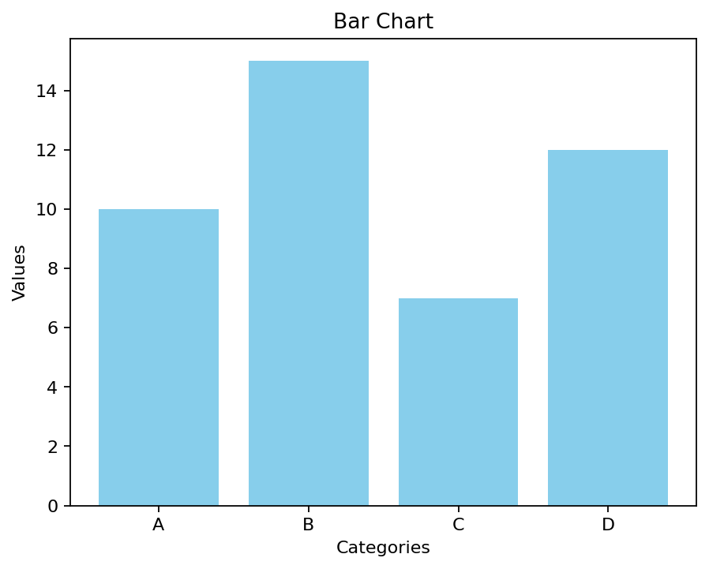
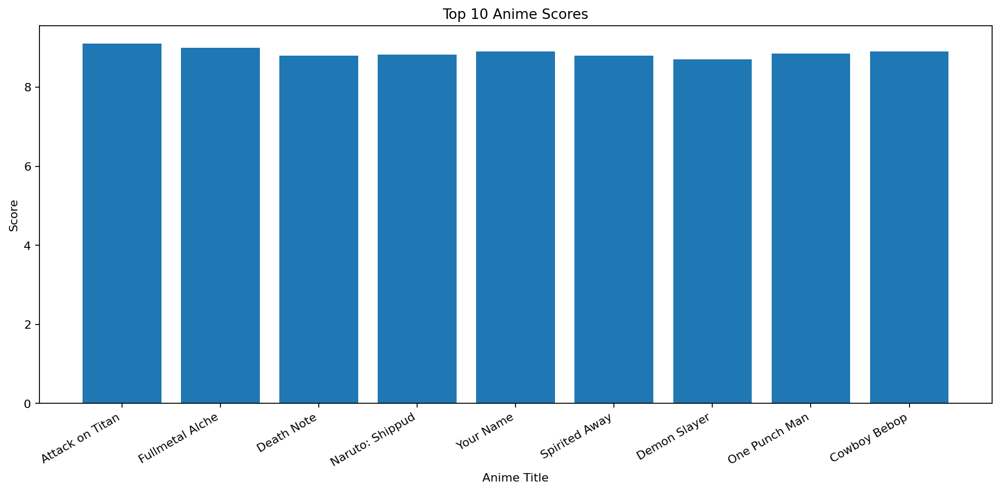
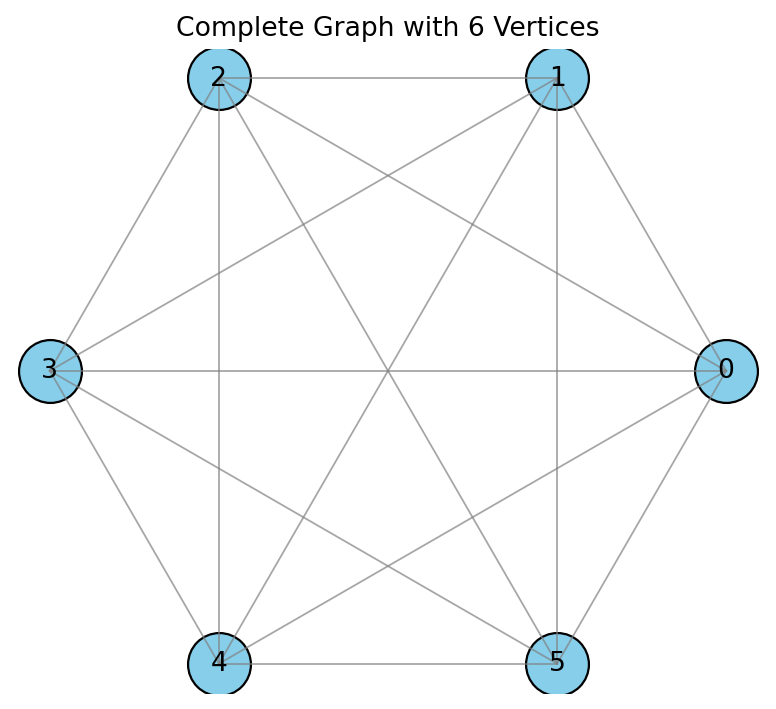

# DMV-LAB

Python lab work for the **Data Management and Visualization** subject, covering static charts, user-input-driven plots, animations, missing-value handling, dataset cleaning, and graph visualization.

## Topics Covered

- static plotting with Matplotlib
- dynamic plotting from user input
- basic animation with `matplotlib.animation`
- missing-value handling with Pandas
- simple outlier treatment
- complete-graph visualization with pure Matplotlib and NumPy

## Repository Structure

```text
.
├── data/
│   └── updated_dataset.csv
├── outputs/
│   └── ...
├── generate_outputs.py
├── requirements.txt
├── static_*.py
├── dynamic_*.py
├── ani_*.py
├── missingvar.py
├── handling_dataset.py
└── ver_graph.py
```

## Included Programs

### Static chart programs
- `static_lc.py`
- `static_barc.py`
- `static_pie.py`
- `static_sp.py`
- `static_hist.py`
- `subplot.py`

### Dynamic chart programs
- `dynamic_lc.py`
- `dyn_barc.py`
- `dyn_pie.py`
- `dyn_scatter.py`
- `dynamic_hist.py`
- `dyn_ani_circle.py`
- `ver_graph.py`

### Animation and data-processing programs
- `ani_line.py`
- `ani_circle.py`
- `missingvar.py`
- `handling_dataset.py`

## Running the Lab Files

Install dependencies:

```bash
python3 -m venv .venv
source .venv/bin/activate
pip install -r requirements.txt
```

Run any individual program:

```bash
python3 static_barc.py
python3 dyn_pie.py
python3 handling_dataset.py
```

## Generated Outputs

This repository includes a helper script that runs the lab programs headlessly and stores their outputs under `outputs/`.

```bash
python3 generate_outputs.py
```

For interactive programs, the helper uses sample inputs so the output can be reproduced consistently inside the repository.

### Output previews

Static bar chart preview:



Dataset-handling preview:



Complete graph preview:



## Dataset Note

`handling_dataset.py` now reads the repo-local sample dataset in [`data/updated_dataset.csv`](./data/updated_dataset.csv) instead of a machine-specific absolute path, which makes the lab file portable and runnable from this clone.
